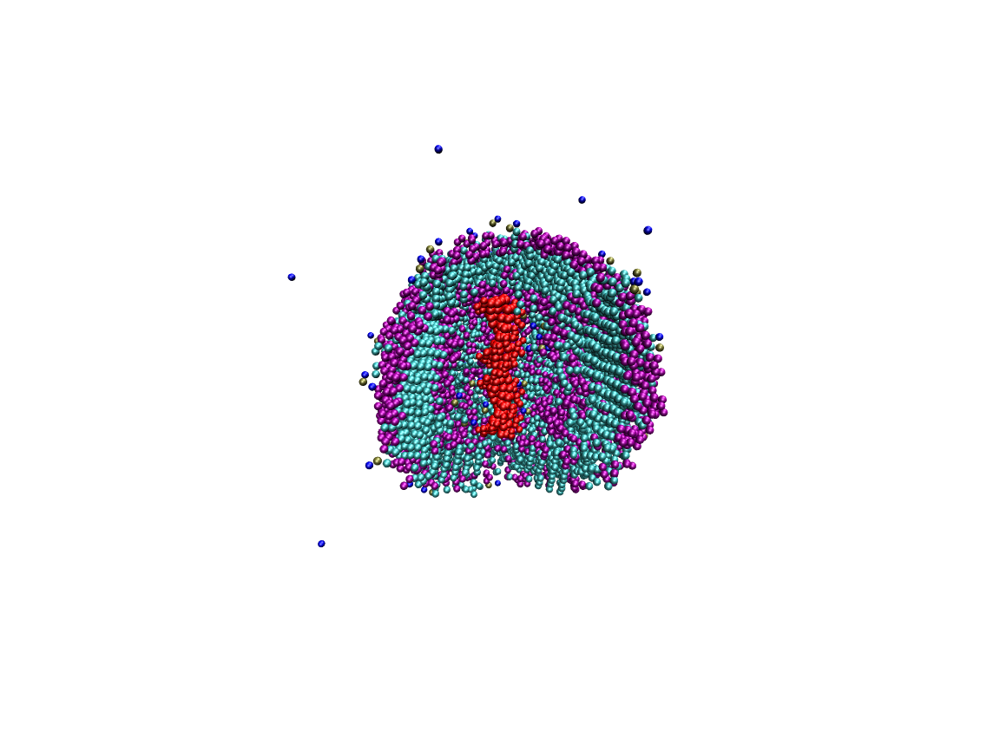
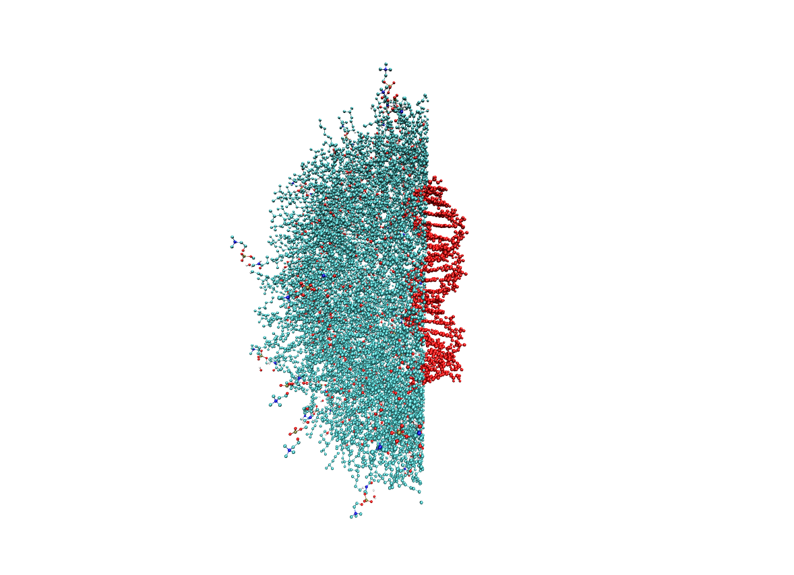

# Manual mapping of a complex system

In this example we are going to map a system constituted by a DNA fragment embebed in a vesicle composed by DPSM and VTE molecules. This vesicle is solvated by a huge number of water molecules. We will change this system from coarse-grained resolution to a fully united atom model (no hydrogens). Here is a snapshot of the sliced vesicle:



We will map this system following a more flexible process than that used in the IL mapping example, in other words, we are not going to use the `Manager` class. Doing the mapping in this way will allow you for example to force the molecule corresponding even when molecules in the initial and final resolution do not match.

## Initializing the system and the components

The first thing that we need to do is to load the objects with the information of the system that we want to map. So firstly, we are going to initialize a `System` object with no information about the molecular connections. This will create an empty system (no molecules are recognized):


```python
from gaddlemaps import DATA_FILES_PATH
from gaddlemaps.components import System

system = System(DATA_FILES_PATH['system_CG.gro'])
print(system)
```

    Simulation system with no loaded molecules.


Now we are going to load the molecules that we want to map. The solvent molecules as well as the ions are not recommended to be mapped to gain performance. Moreover, the system can be resolvated again once it is in the final resolution. That said, we load only the DNA fragment, the DPSM and VTE:


```python
system.add_ftop(DATA_FILES_PATH['DNA_CG.itp'])
system.add_ftop(DATA_FILES_PATH['vitamin_E_CG.itp'])
system.add_ftop(DATA_FILES_PATH['DPSM_CG.itp'])
print(system)
```

    Simulation system with:
    
    DNA   : 1
    DPSM  : 67
    VTE   : 1000


Now we need to create the exchange maps for each type of molecules to finally extrapolate the found mapping to the whole system. For these exchange maps we need a representation for each type of molecules in both initial and final resolution. For the initial resolution we can take them from the already loaded system. For the final resolution we need to load new `Molecule` objects. Once we have all the requirements we are going to use the `Alignment` class to deal with the process of finding the optimal mapping. Lets see how to proceed:


```python
from gaddlemaps import Alignment
from gaddlemaps.components import Molecule

# Initial resolution molecules
# Check the order in different_molecules before the assignment
dna_initial, vte_initial, dpsm_initial = system.different_molecules

# Load final resolution molecules
dna_final = Molecule.from_files(DATA_FILES_PATH['DNA_AA.gro'], DATA_FILES_PATH['DNA_AA.itp'])
dpsm_final = Molecule.from_files(DATA_FILES_PATH['DPSM_AA.gro'], DATA_FILES_PATH['DPSM_AA.itp'])
vte_final = Molecule.from_files(DATA_FILES_PATH['VTE_AA.gro'], DATA_FILES_PATH['VTE_AA.itp'])

# Initialize the alignments
dna_align = Alignment(start=dna_initial, end=dna_final)
dpsm_align = Alignment(start=dpsm_initial, end=dpsm_final)
vte_align = Alignment(start=vte_initial, end=vte_final)
```

Take into account that in the initialization of the `Alignment` objects you can set whichever molecule you want as end resolution. This opens the door to use gaddlemaps to change molecules in your system. For example change a membrane of POPC with one of PCCP keeping the configuration of the initial molecules. Now we need to align molecules in both resolution to finally obtain the exchange maps. This can be done with the initialized objects. However, before starting the alignment we should think about passing constrains to the algorithm. Lets discuss the constrains for each molecule type:

- DNA fragment: As we said before, this can be considered as a protein as it is a molecule with multiple residues. When this is the case, the Alignment will automatically optimize the process assigning constrains for all the atoms using the residue sequence through the `guess_protein_restrains` function. So generally, we do not have to worry about this kind of big molecules. NOTE: If we now that the residue sequence in both resolution do not match we should set the `auto_guess_protein_restrictions` argument to `False`.

- DPSM: This molecule can be very tricky to map as it is formed by three ramifications. One of them is a polar head and the others are organic tails of different lengths. As the algorithm does not use atom types to identify restrains we should pass our own clues about which atoms match some beads. For this molecule two or three restrains indicating the terminal atoms correspondence of each branch should be more than enough. We can select this restrains using the graphical interface that the `interactive_restrictions` method brings us or, if we already now the atoms index in both resolution we can just set the restrictions to a list. For example: 
```
restrictions = [(0, 44), (8, 34), (5, 0)]
```
Bellow we will select this restrains with the graphical interface.

- VTE: This molecule is simpler than DPSM but its linearity may induce to anti-parallel alignments so we will pass a restriction to tell the algorithm which bead corresponds with the atom in the terminal carbon (not the head).
```
restrictions = [(0, 29)]
```


```python
# Graphically select the restrictions
box, dpsm_restrictions = dpsm_align.interactive_restrictions()
box
```


    _ColormakerRegistry()


    VBox(children=(Label(value='Low Resolution'), NGLWidget(), Label(value='High Resolution'), NGLWidget(), HBox(c…


Once the restrictions are chosen we can initialize the alignment process. However, before continuing, lets see some of the functionalities that the alignment process offers through its arguments:

- `restrictions`: These are the restrictions mentioned before. They help the algorithm to find the best alignment. **NOTE**: If the molecule has multiple residues and you want to automatically assign the restrictions this argument must be `None`.
- `deformation_types`: The algorithm will randomly change the position of the molecules to find the optimum alignment. These changes in each step are also randomly chosen by default between three types of changes: translations, rotations and atomic deformations (see the article for a better explanation). With this argument we can change these types of changes for example to only perform translations and rotations. This argument can be very handy when we know that the molecules in the initial and final resolutions are in the same configuration. In this case, setting this argument to (0, 1), we can avoid to perform atomic deformations which is the most computational time demanded change.
- `ignore_hydrogens`: If True (which is the default), the hydrogen atoms will be ignored in the distances calculations. This results in better performance.
- `auto_guess_protein_restrictions`: If True (default) and `restrictions` is None, the restrains will be automatically set if the molecule has more than one residue using the residue sequence.

With these considerations we can now align our molecules. This step can take a while depending on the molecules you want to align and specially on the backend implementation you are using. For example: the DPSM molecule will take less than 1 second with the c++ implementation and around 20 seconds using the python one. However, this difference is larger when large molecules are considered, e.g. for the DNA molecule the process takes around 2 minutes with the c++ backend and around 1 hour with the other. This means that if you are mapping systems with small molecules you can avoid the c++ backend installation. However, if you are planning to map large molecules like proteins you should spend some time in the installation.

**NOTE 1**: If you are using the c++ extension for the backend (which is highly recommended) you will not see any output during the process in the cell. The output will be displayed in the terminal where the jupyter-notebook is running. We are working on fixing this. 

**NOTE 2**: You can avoid the alignment process if you initialize the `Alignment` object with molecular configurations that have been already aligned before, e.g. you have already aligned the molecules for mapping other systems.


```python
# the restrictions are manually set to avoid different results for this example
dpsm_restrictions = [(0, 44), (8, 34), (5, 0)]
vte_restrictions = [(0, 29)]

vte_align.align_molecules(restrictions=vte_restrictions)
dpsm_align.align_molecules(restrictions=dpsm_restrictions)
dna_align.align_molecules()
```

Once the molecules are aligned in both resolutions the first thing that can be done is to check if the obtained molecular overlap is good. For that we can use the `copare_molecules` function. Bellow we represent the comparative for the DNA. The other molecules would be done in the same way.


```python
from gaddlemaps import compare_molecules

compare_molecules(dna_align.start, dna_align.end)
```


    NGLWidget()


If you see that one of the alignment is not good you can always call again the `align_molecules` method for the wrong aligned molecule with new restrictions to fix it. Once we get the correct alignments we can continue with the extrapolation process. However, it can be useful save the molecular configurations to avoid repeating the alignment in future maps. For that we just have to write the atoms positions in files using, for example, the `write_gro` method of molecules:


```python
# Write example for dna
dna_align.start.write_gro('dna_align_initial.gro')
dna_align.end.write_gro('dna_align_final.gro')
```

Now we can initialize the exchange maps to finally extrapolate the alignment to all the configurations in the simulation system. We just have to call the `init_exchange_map` method. Optionally, we can pass a value for the `scale_factor` parameter that will scale the molecules when they are mapped to the final resolution. A `scale_factor` less than one will make the molecules to look smaller while a factor larger than one will increase its size. The default value is set to 0.5 which avoid overlaps between different molecules when all the system is mapped and has been tested for MD simulations. 


```python
vte_align.init_exchange_map(1)
dpsm_align.init_exchange_map(1)
dna_align.init_exchange_map(1)
# Create a dictionary that will be used for the extrapolation
exchanges = {
    vte_align.start.name: vte_align.exchange_map,
    dpsm_align.start.name: dpsm_align.exchange_map,
    dna_align.start.name: dna_align.exchange_map,
}
```

Now, with the exchange maps initialized we can extrapolate the alignment to the system. For that we are going to iterate through all the molecules in the system and change its resolution using the corresponding map. In this process we are going to be writing the final system.


```python
from gaddlemaps.parsers import open_coordinate_file


with open_coordinate_file('system_mapped.gro', 'w') as fgro:
    fgro.comment = system.system_gro.comment_line
    fgro.box_matrix = system.system_gro.box_matrix
    # We are fixing the atom indexes
    atom_index = 1
    for mol in system:
        name = mol.name
        # Check if the molecule has to be mapped
        if name not in exchanges:
            continue
        # Call the corresponding exchange_map
        new_mol = exchanges[name](mol)
        for atom in new_mol:
            line = atom.gro_line()
            line[3] = atom_index
            atom_index += 1
            fgro.writeline(line)
```

We finally get a file with the mapped system. Note that the `system_mapped.gro` file will contain a very strange version of the molecules due to the scale factor of 0.5. With a short energy minimization this will be fixed. Bellow you can see a snapshot of this map but with a scale factor of 1 (for a better visualization).


